<div align="center">
  
</div>

<br/>

<div align="center">

Generate a complete, **gated, premium logo set** as clean procedural SVG —<br/>
from a single minimalist mark to a full animated identity system.

</div>

---

## What It Is

Logo Forge is a Claude Code skill that produces professional-grade brand identity systems. It generates SVG procedurally (never raster/diffusion), runs every candidate through deterministic quality gates, and delivers a full variant matrix ready for production use.

The core premise: **scripts hold the line across runs; agent instructions drift.** Gates are blocking — a candidate that fails does not get carried forward silently.

---

## Trigger Conditions

This skill activates automatically when you ask for any of:

| Phrasing | Example |
|----------|---------|
| Logo / brand mark | *"I need a logo for my startup"* |
| Icon or favicon | *"make an icon for X"*, *"generate a favicon set"* |
| Wordmark / monogram | *"design a wordmark for Y"*, *"create a monogram"* |
| App icon set | *"I need an app icon"* |
| Animated / motion logo | *"animate my logo"*, *"stroke-draw reveal"* |
| Full visual identity | *"give this project a visual identity"*, *"brand this app"* |

---

## The Pipeline

```
 Brief intake
      │
      ▼
 ┌─────────────────────────────────────────────────────────────┐
 │  Step 0  Load / fill BRAND.spec.md (single source of truth) │
 └─────────────────────────────────────────────────────────────┘
      │
      ▼
 ┌─────────────────────────────────────────────────────────────┐
 │  Step 1  Brief intake — name, niche, style dial, scope,     │
 │          concrete-metaphor anchor (ask one Q if ambiguous)  │
 └─────────────────────────────────────────────────────────────┘
      │
      ▼
 ┌─────────────────────────────────────────────────────────────┐
 │  Step 2  Taste lock — design-language anchor, banned-motif  │
 │          list, palette, max color count                     │
 └─────────────────────────────────────────────────────────────┘
      │
      ▼
 ┌─────────────────────────────────────────────────────────────┐
 │  Step 3  Fan-out: 5 distinct directions (parallel if able)  │
 │                                                             │
 │  concrete-metaphor.svg  ·  monogram.svg  ·  negative-       │
 │  space.svg  ·  geometric-abstract.svg  ·  wordmark.svg      │
 └─────────────────────────────────────────────────────────────┘
      │
      ▼
 ┌─────────────────────────────────────────────────────────────┐
 │  Step 4  GATE — blocking, exit-code checked                 │
 │                                                             │
 │  lf_slop.py  ──  SVG hygiene, cliché-shape score,          │
 │                  stroke-width variance, path-count          │
 │  lf_color.py ──  palette conformance, color-count cap       │
 │                                                             │
 │  Non-zero exit = candidate dropped. No silent carry-forward.│
 └─────────────────────────────────────────────────────────────┘
      │  (only passing candidates)
      ▼
 ┌─────────────────────────────────────────────────────────────┐
 │  Step 5  Flat black-and-white + small-size legibility check │
 │          (automated via lf_color.py --legibility-check      │
 │          when rsvg-convert / resvg / Inkscape present)      │
 └─────────────────────────────────────────────────────────────┘
      │
      ▼
 ┌─────────────────────────────────────────────────────────────┐
 │  Step 6  Critique and rank — top 1–2 presented, rest as     │
 │          alternates; scored on balance, distinctiveness,    │
 │          favicon legibility, motion-readiness               │
 └─────────────────────────────────────────────────────────────┘
      │  (chosen direction)
      ▼
 ┌─────────────────────────────────────────────────────────────┐
 │  Step 7  Full deliverable set — all variants + spec sheet + │
 │          lf_export.py (PNG matrix, favicon.ico, app icons)  │
 └─────────────────────────────────────────────────────────────┘
      │  (if animation was in scope)
      ▼
 ┌─────────────────────────────────────────────────────────────┐
 │  Step 8  Animation — SMIL/CSS stroke-draw (default),        │
 │          GSAP/anime.js morph, or Lottie JSON                │
 └─────────────────────────────────────────────────────────────┘
      │
      ▼
 ┌─────────────────────────────────────────────────────────────┐
 │  Step 9  Deliver — full folder + spec sheet + gate skip log │
 └─────────────────────────────────────────────────────────────┘
```

---

## Deliverable Matrix

Every completed run produces:

```
brand/
├── primary.svg                  ← combination mark (icon + wordmark)
├── icon.svg                     ← symbol only
├── wordmark.svg                 ← text only
├── monogram.svg                 ← initials (if applicable)
├── primary-horizontal.svg
├── primary-stacked.svg
├── variants/
│   ├── primary-black.svg        ← flat black (the B&W test output)
│   ├── primary-white.svg        ← reversed / white-on-dark
│   ├── icon-black.svg
│   └── icon-white.svg
├── export/
│   ├── favicon.ico              ← multi-size: 16/32/48px
│   ├── icon-16.png … icon-512.png
│   ├── ios/                     ← App Store size set
│   ├── android/                 ← adaptive-icon / mipmap
│   └── social/                  ← profile crop + cover variant
├── spec-sheet.md                ← min size, clear space, palette, don'ts
└── animated/                   ← (if animation was in scope)
    ├── icon-reveal.svg          ← SMIL/CSS stroke-draw
    └── icon-reveal.json         ← Lottie (only if generated)
```

---

## Quality Gates

Two Python scripts gate every candidate. Both require **zero third-party installs** (stdlib only). A non-zero exit is a hard block — the candidate is dropped or fixed before it advances.

### `lf_slop.py` — Shape hygiene + cliché detection

| Check | What it catches |
|-------|----------------|
| Circular-gradient blob | Near-circular shape + radial/linear gradient + radiating internals |
| Generic swoosh | Single long bezier with no other content |
| Stroke-width variance | Inconsistent widths → proxy for "not actually gridded" |
| Path-count heuristic | Too many paths on a mark-tagged file → doodle, not a constructed mark |
| Raster/external refs | `<image>`, external `href`, data-URI bitmaps |
| Overused AI-default fonts | Detected from inline `font-family` attributes |

### `lf_color.py` — Palette conformance + legibility

| Check | What it catches |
|-------|----------------|
| Color count cap | More colors than the spec allows |
| Gradient usage | Unless explicitly permitted in BRAND.spec.md |
| Legibility at 16px | Automated flat-B&W render at 16/32px (requires rasterizer on PATH) |
| Degraded-gracefully | Missing rasterizer → explicit warning, never silent skip |

---

## Anti-Patterns Blocked

These are the structural/stylistic clichés the gate actively hunts. The full catalog is in [`references/anti-patterns.md`](references/anti-patterns.md).

```
 ✗  Circular gradient blob with radiating petals   (AI-company trope, 2025–26)
 ✗  Generic single-swoosh path                     (motion implied by zero shape)
 ✗  Gradient covering for an unresolved flat form  (color doing shape's job)
 ✗  Shield / badge as a generic trust container    (content-free container)
 ✗  Blue circle · checkmark · lightbulb            (default nouns of logo design)
 ✗  Abstract V-man figure                          (growth/achievement placeholder)
 ✗  Purple→blue or teal→blue "tech" gradient       (palette cliché #1)
 ✗  Neon-on-dark as default "AI/modern" palette    (palette cliché #2)
 ✗  Unmodified AI-default font at 100% tracking    (the typographic tell)
 ✗  Anchoring to "other companies like us"         (direction by averaging)
```

The last one is the most important and has no gate — it's a prompt-level discipline. The skill anchors every direction to either a **concrete physical object from the niche** or a **named design movement**, never to "the category of logos that exist in this space."

---

## Design Anchors

One of five design languages is selected at the start of every run and governs all construction decisions for that session:

| Anchor | Grammar | Good for |
|--------|----------|----------|
| **Bauhaus** | Primary geometric shapes, primary colors, function-follows-form | Construction, education, craft |
| **Swiss / ITS** | Grid-driven, sans-serif, asymmetric balance, near-monochrome + one accent | Anything precise, technical, no-nonsense |
| **Memphis** | Playful geometric collage, unexpected color pairing, controlled-loud | Consumer, lifestyle, youth-oriented |
| **Mid-century modern** | Organic-but-controlled curves, warm restrained palettes, confident shapes | Hospitality, food, craft |
| **Constructivism** | Diagonal energy, bold geometric intersection, high contrast | Anything dynamic/movement-oriented |

---

## Construction Disciplines

Every candidate is built on an **explicit declared grid** before any path is placed:

```
φ (golden ratio)  — timeless / classical / premium
       1:1         — stability / reliability   ← default
       3:2         — editorial / dynamic
  isometric 30°   — geometric-abstract directions
```

The **flat black-and-white test** is the single most reliable premium/slop discriminator: strip all color, render fill:#000 on white. If the mark collapses into an indistinct blob, the shape isn't resolved — regardless of how it looks in color.

---

## Animation Tiers

| Tier | Technology | When to use |
|------|-----------|-------------|
| **Stroke-draw** (default) | SMIL / CSS | Self-contained SVG reveal; no runtime; agent-authorable directly |
| **Sequenced / morph** | GSAP / anime.js | Richer staging or shape-morphs between two structurally-matched candidates |
| **Cross-platform** | Lottie JSON | iOS/Android native playback required; generated programmatically |

All animated variants ship with a **static fallback frame** alongside them.

---

## Reference Files

| File | Read when |
|------|-----------|
| [`references/design-principles.md`](references/design-principles.md) | Before generating any candidate (Step 3) |
| [`references/anti-patterns.md`](references/anti-patterns.md) | Step 2 taste lock + any gate failure |
| [`references/taste-system.md`](references/taste-system.md) | Step 2 — style dials, banned-motif defaults, concrete-metaphor seeds |
| [`references/deliverable-spec.md`](references/deliverable-spec.md) | Step 7 — full variant manifest and brand-guideline structure |
| [`references/animation-guide.md`](references/animation-guide.md) | Step 8 — only if animation is in scope |
| [`assets/BRAND.spec.template.md`](assets/BRAND.spec.template.md) | Step 0 — copy to project, fill in from brief |

---

## Scripts

| Script | Purpose | External deps |
|--------|---------|---------------|
| [`scripts/lf_slop.py`](scripts/lf_slop.py) | SVG hygiene, cliché-shape detection, doodle heuristic | None (stdlib) |
| [`scripts/lf_color.py`](scripts/lf_color.py) | Palette conformance, color-count gate, legibility-at-size | Optional: `rsvg-convert`, `resvg`, or `inkscape` for raster check |
| [`scripts/lf_export.py`](scripts/lf_export.py) | PNG size matrix, `favicon.ico` packing, app-icon sets | One rasterizer for PNG/ICO; `.ico` packing is pure-Python |

All three scripts report skipped steps explicitly — nothing is silently omitted.

---

## After Cloning

Run once after cloning:

```bash
./setup.sh
```

This sets `core.hooksPath` to `.githooks` and copies `.blocked.example` to `.blocked`. Then edit `.githooks/.blocked` to add your own patterns — it is gitignored and never pushed.

Without `.blocked` the hooks exit silently and impose no restrictions.

---

<div align="center">
<sub>Logo Forge · Claude Code Skill · <a href="SKILL.md">SKILL.md</a></sub>
</div>
